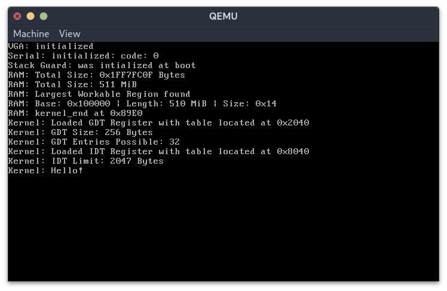

## Project sinkhole

Project sinkhole is an attempt at creating a small, simple, experimental Operating System.

### Progress

- [ ] Bootloader
- [ ] C++ Support
  - [x] Simple Global Constructor calls
- [ ] Documentation
- [ ] Debugging
- [ ] File System
- [x] Global Descriptor Table
- [x] Interrupts (IDT, IDTR)
- [ ] Keyboard Input
- [ ] Libc
- [ ] Major Drivers
- [x] Memory Detection
- [ ] Memory Map
- [ ] Program Loading
- [ ] Serial Input Output
  - [ ] Input
  - [x] Output
- [x] Stack Smashing Protection
- [x] VGA Output

| Qemu Output |
|-------------|
|  |

### Current Ideas

### References
1. [OSDev Wiki](https://wiki.osdev.com/)
2. [Operating System Concepts by Abraham Silberschatz, Greg Gagne, and Peter Baer Galvin](https://g.co/kgs/BieKkyc)
3. [GNU Binutils Manual](https://sourceware.org/binutils/docs/)
4. [Intel 64 and IA-32 Manuals, vol 1-5](https://www.intel.com/content/www/us/en/developer/articles/technical/intel-sdm.html)
5. [AMD64 Architecture Programmer's Manual, vol 1-5](https://www.amd.com/content/dam/amd/en/documents/processor-tech-docs/programmer-references/40332.pdf)

...and lots of other helpful resources and articles stumbled upon while
performing searches. Too many to list. I thank everyone who is commited to
sharing of knowledge.